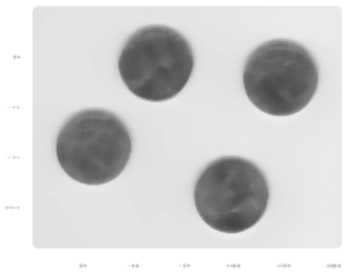

# Фильтрация изображений
В данной работе применялись различные фильтры к изображениям, среди которых медианный, билатеральный фильтры, фильтр CLAHE, Соболя, Габора.

<!--Использованные фильтры-->

1. ***Применение медианного фильтра.***
Медианный фильтр — это возможность подавить ненужные шумовые сигналы. Этот фильтр хорошо отсеивает два типа шума: высокочастотный (High-frequency noise**) и низкочастотный (Low-frequency noise**).  
*Original image:*  
  
*Median Filter:*  

2. ***Применение билатерального фильтра.***
Билатеральное фильтрование - это нелинейная техника фильтрования. Пиксели, которые сильно отличаются по интенсивности от центрального пикселя, увеличиваются в меньшей степени, даже не смотря на то, что они могут находиться в непосредственной близости к центральному пикселю.  
*Original image:*  
    
*The bilateral filter:*  

3. ***Применение фильтра CLAHE***  
Метод CLAHE используется для улучшения контрастности изображений. Он отличается от обычного выравнивания гистограмм тем, что адаптивный метод вычисляет несколько гистограмм, каждая из которых соответствует отдельному участку изображения, и использует их для перераспределения значений яркости изображения. Таким образом, это может улучшить локальный контраст и улучшить четкость границ в каждой области изображения.  
*Original image:*  
  
*CLAHE filter:*  

4. ***Применение фильтра Собеля***  
Фильтр Собеля - дискретный дифференциальный оператор, который используется для приближения градиента яркости изображения. Он используется в алгоритмах выделения границ при обработке изображений.  
*Original image:*  
  
*Sobel filter:*    

5. ***Применение фильтра Габора***  
Фильтр Габора — линейный электронный фильтр, импульсная переходная характеристика которого определяется в виде гармонической функции, помноженной на гауссиан. При цифровой обработке изображений этот фильтр применяется для распознавания границ объектов.  
*Original image:*  
  
*Gabor filter:*  

