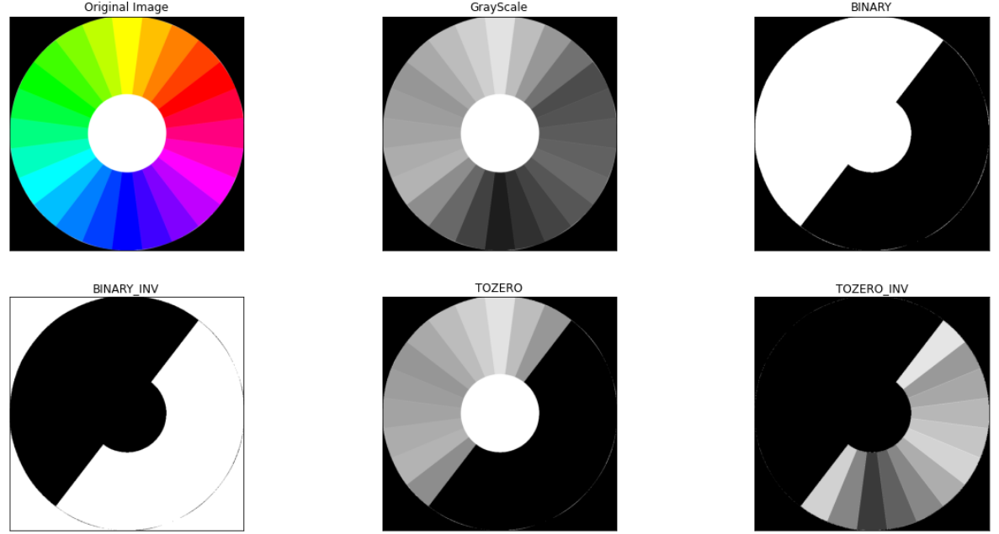
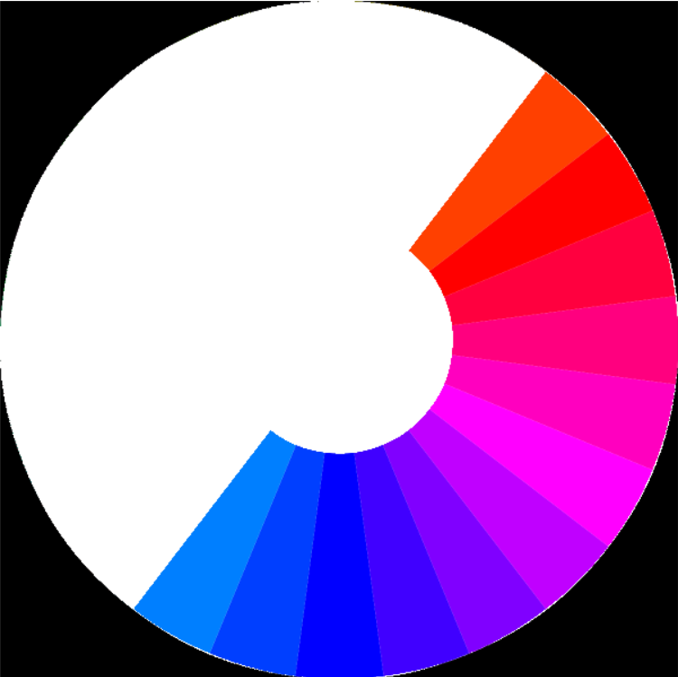
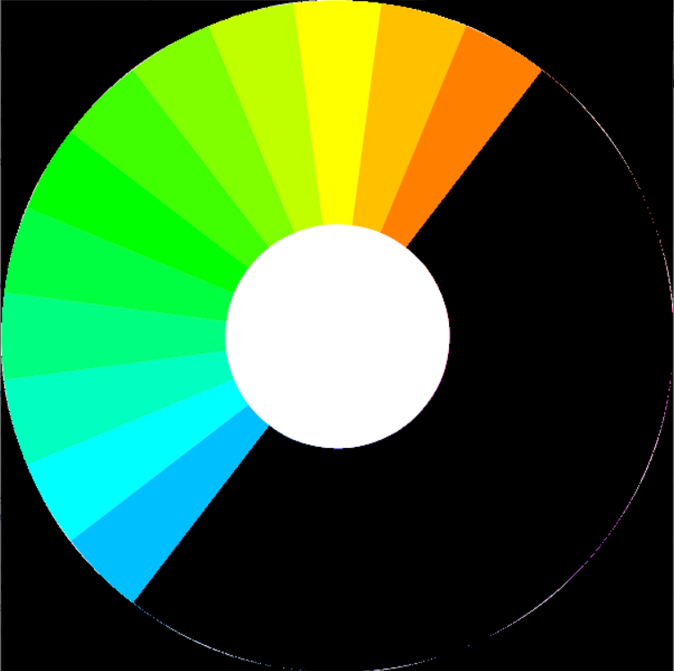
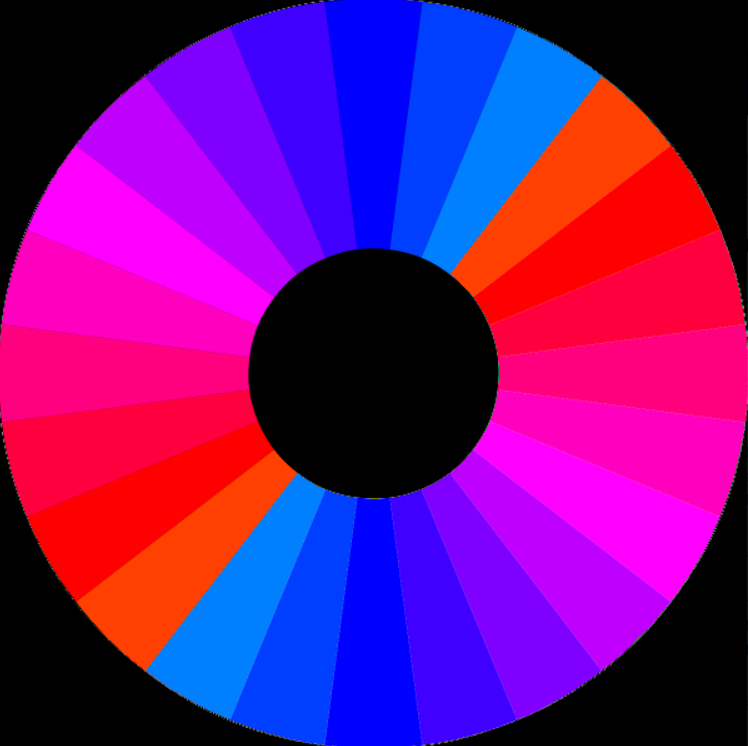

# Алгоритмы обработки изображений.
В данной работе к изображениям применялись различные алгоритмы по их обработке, среди которых бинаризация, маска, эрозия, дилатация.

1. ***Бинаризация.***  
Бинаризации – это перевод цветного (или в градациях серого) изображения в двухцветное черно-белое. Главным параметром такого преобразования является порог t – значение, с которым сравнивается яркость каждого пикселя. По результатам сравнения, пикселю присваивается значение 0 или 1.  
*Пример применения различной бинаризации:*  
   
3. ***Наложение маски.***  
Битовая маска — определённые данные, которые используются для маскирования — выбора отдельных битов или полей из нескольких битов из двоичной строки или числа.  
*Получение битовой маски методом бинаризации:*
  
*Сложение оригинального изображения с битовой маской:*
  
*Перемножение оригинального изображения с битовой маской:*
  
*Исключающее или изображения с битовой маской:*
    
5. ***Эрозия.***  
Фильтр Эрозия уменьшает область изображения, приводя к истончению пикселей, расширяя и усиливая светлые места на изображении. Суть данного преобразования состоит в том, что нежелательные вкрапления и шумы размываются, а большие и, соответственно, значимые участки изображения изменениям не подвергаются.  
*Оригинальное изображение:*  
  
*Применение операции эрозии к изображению:*  
   
7. ***Дилатация.***  
Дилатация (морфологическое расширение) – свертка изображения или выделенной области изображения с некоторым ядром. Ядро может иметь произвольную форму и размер. При этом в ядре выделяется единственная ведущая позиция (anchor), которая совмещается с текущим пикселем при вычислении свертки.  
*Оригинальное изображение:*    
  
*Применение операции дилатации:*  
  
8. ***Примеры применения***  
*Оригинальное изображение с черными точками вне объекта:*  
    
*Изображение после обработки:*  
    
*Оригинал изображения с черными точками на объекте:*  
    
*Изображение после обработки:*  

