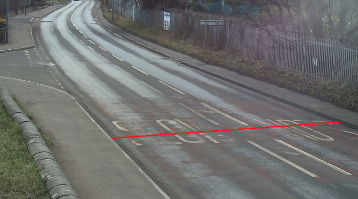
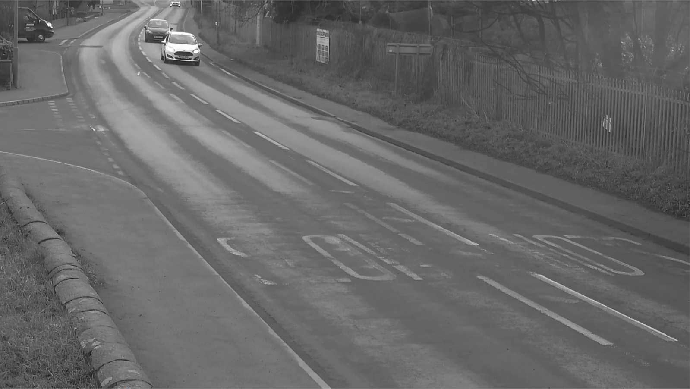
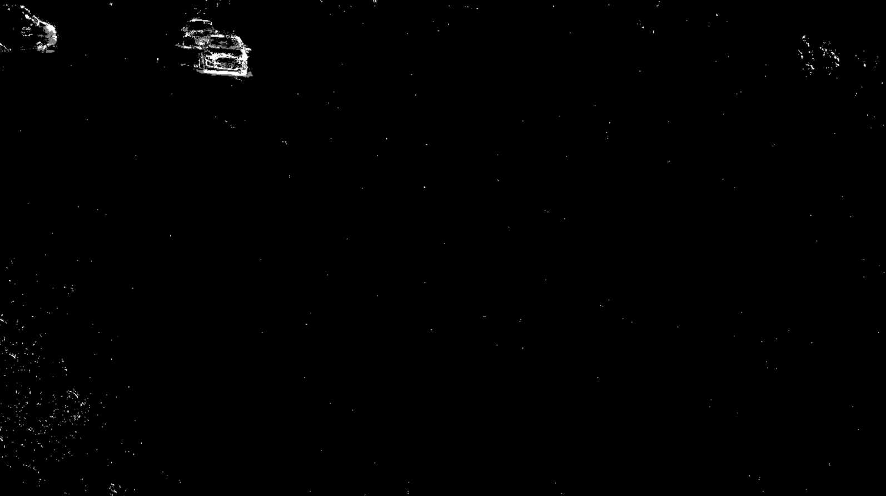
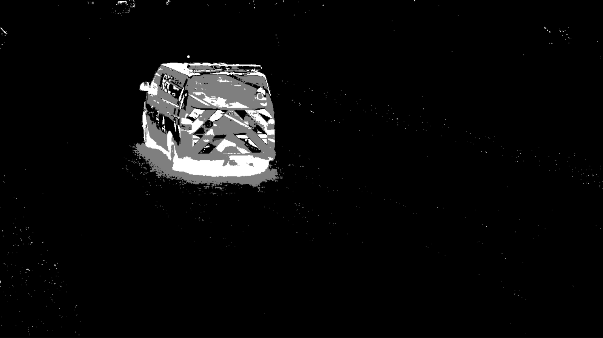
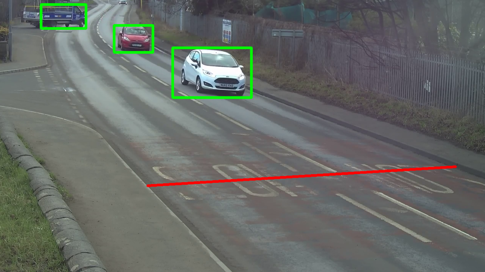

# Построение простейшего детектора объектов в кадре.

Задачи, которые ставились в рамках данной работы:

1. Загрузить видео.
2. Преобразовтаь его в 8-ми битное цветовое пространство.
3. При необходимости применить медианную фильтрацию.
4. Разработать алгоритм, обнаруживающий объекты на изображении путем вычитания фона. Необходимо было выбрать один из двух вариантов – воспользоваться встроенным в OpenCV инструментом для вычитания фона - BackgroundSubtractorMOG2, либо вручную находить разницу между фоном и текущим кадром на каждой итерации алгоритма.
5. Разработать алгоритм, отрисовывающий поверх оригинального видео рамки детекции (bounding boxes) объектов, найденных в п.4.
6. Путем подбора параметров медианной фильтрации, уровня бинаризации и морфологических преобразований добиться максимальной точности обнаружения автомобилей.
7. Разработать алгоритм, подсчитывающий количество автомобилей, проехавших через красную линию в каждую сторону. Результат должен отображаться в текстовом виде, например: по правой полосе проехало 3 автомобиля, по левой 2 автомобиля…

*Красная линия:* 

 

*Кадр из преобразованного видео в 8-им битное цветовое пространство:*

 

*Кадры с отделенными от фона объектами:*

 

 

*Кадры с отрисованными вокруг объектов прямоугольниками:*

 
