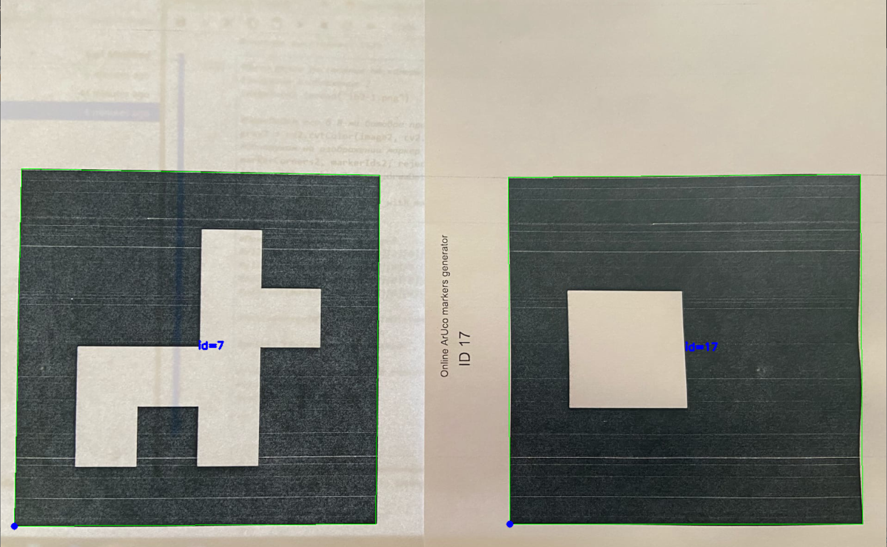

# Распознавание маркеров, вычисление расстояния до них.

1. Распознавание маркеров.  
   Загружаем словарь, который использовался при созданиии маркеров, преобразовываем изображение в 8-ми битовое пространство и обнаруживаем маркеры.  
   *Распознанные маркеры:*
   
   
2. Для вычисления расстояния до маркеров получим их координаты.  
   *Проверка в правильности нахождения координат:*
   
   
3. С помощью евклидова расстояния вычисляем удаление камеры от маркеров.  
   Для представленного в работе изображения вычисленное расстояние составило 30 См, что является истинной.

