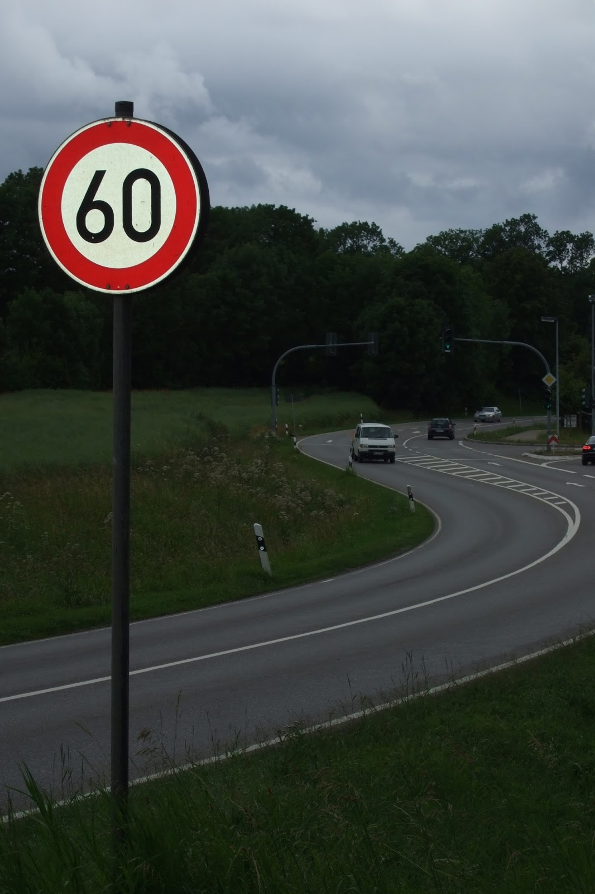
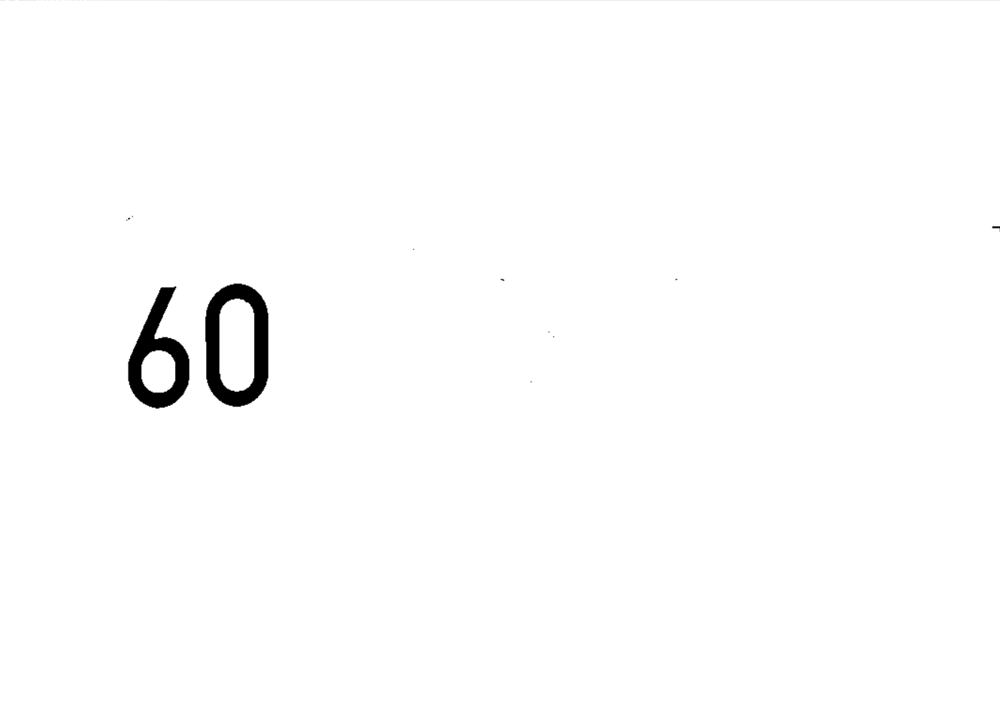

# Распознавание дорожных знаков с помощью pytesseract

В данной работе распознаются дорожные знаки на изображениях с помощью pytesseract.

1. Преобразуем исходное изображение в 8-ми битовое цветовое пространство.
2. Бинаризуем изображение.
3. Ищем контуры и выполняем операцию эрозии.
4. Заливаем остальной фон белым цветом и выводим результат.

*Изображение с дорожным знаком:*

*Распознанный знак:*

*Изображение с дорожным знаком:*

*Распознанный знак:*

