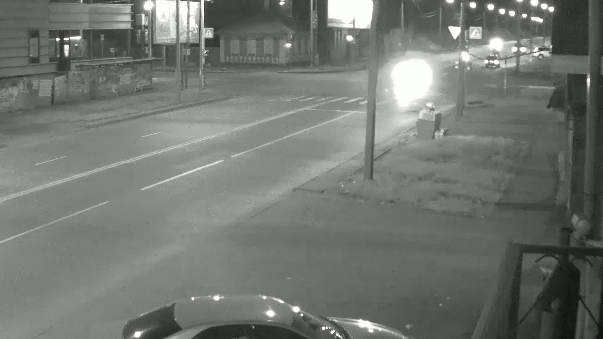
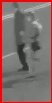
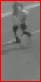

# Программа поиска объектов в обпределенной части кадра.

В данной работе требуется обнаружить и сохранить нарушения правил дорожного движения, а именно переход дороги в неположенном месте.

*Место, где осуществляется контроль:*

В качестве детектора была использлвана предобученная модель Каскадного классификатора для поиска людей в полный рост (haarcascade_fullbody).

Нарушения сохраняются в виде отдельных изображений, названия которых содержат дату и время нарушений - формат "%A %d %m %Y, %H. %M. %S".

*Пример нарушений:*

