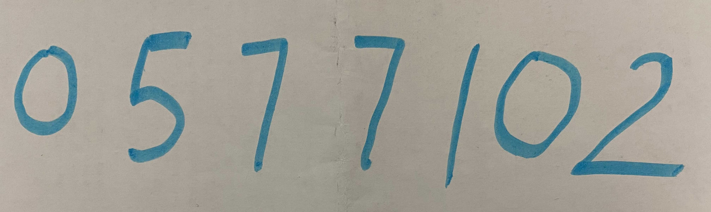

# Распознавание рукописных цифр

В данной работе с помощью обеченной на датасете MNIST нейронной сети будут распознаны рукописные цифры.

- Использованный для обучения датасет: MNIST
- Обучающая выборка 60к, тестовая выборка 10к
- Количество эпох обучения: 5.
- Точность обученной модели 97%

Для проверки работы обученной модели подадим на вход рукописные цифры.

*Пример изображения с рукописными цифрами:*

Результаты распознавания моделью выводятся в виде пиксельного изображения, а также в текстовом виде.
