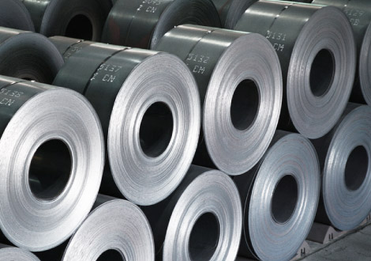
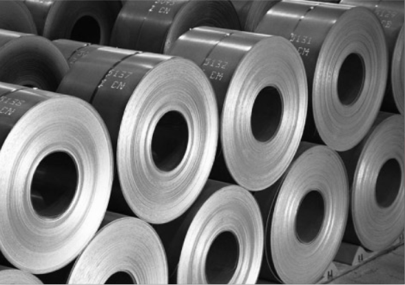
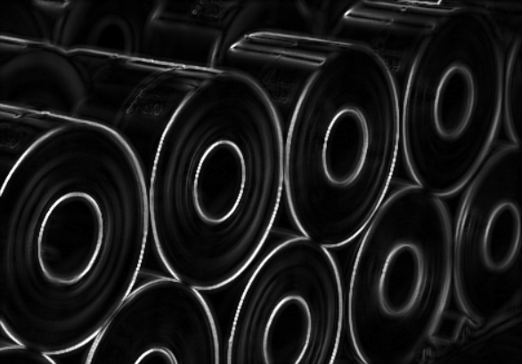
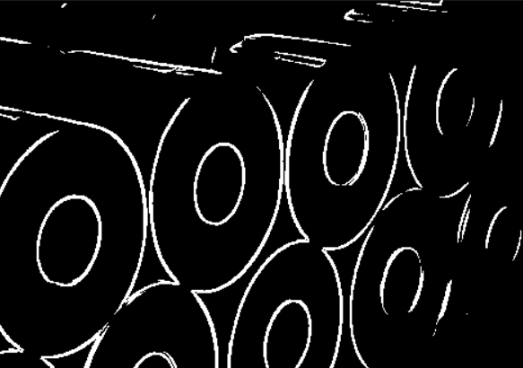
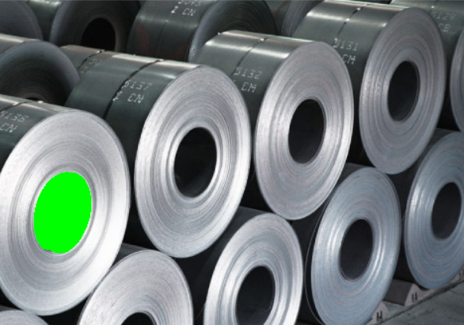

# Обработка изображений с помощью различных фильтров

В данной работе к исходному изображению применялись различные фильтры: медианный, Собеля, Отцу, а также производился поиск максимального по площади контура.

*Исходное изображение:*

*Изображение в 8-ми битовом пространстве:*

*Применение медианного фильтра:*

*Применение фильтра Собеля:*

*Фильтр Отцу:*

*Поиск максимального по площади контура:*

