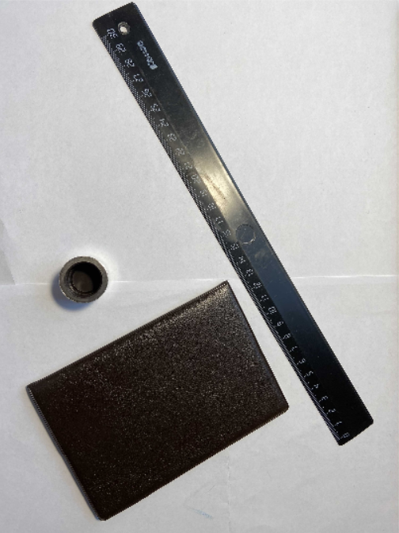
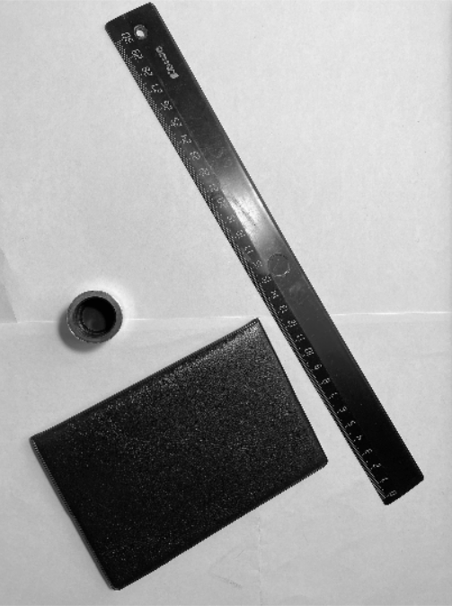
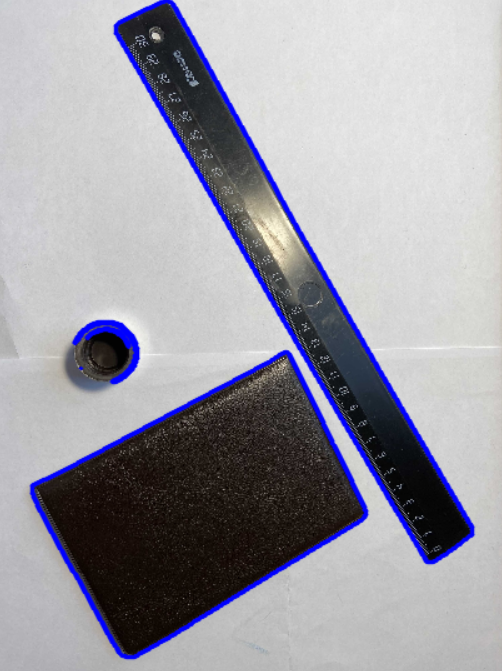
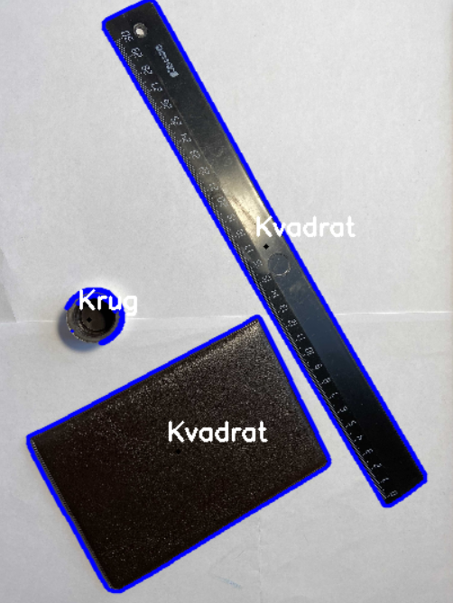
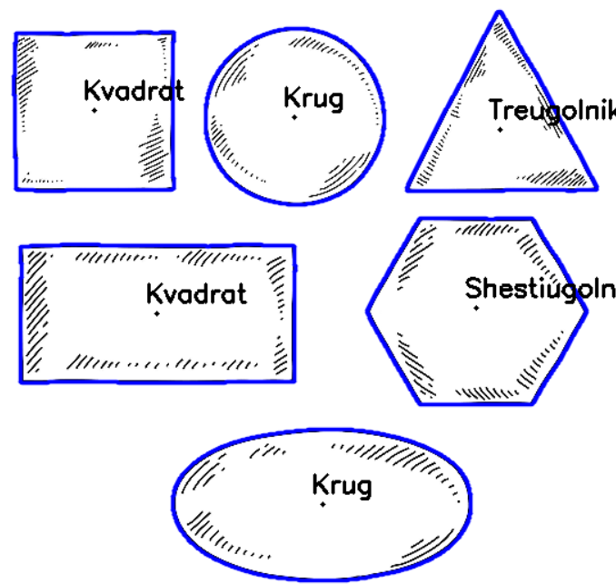

# Поиск геометрических фигур на изображении

В данной работе на изображениях ищутся геометрические фигуры: пятиугольники, треугольники, квадраты, окружности, шестиугольники.

*Оригинальное изображение:*

*Перевод изображения в 8-ми битовое пространство:*

*Поиск контуров:*

*Распознавание геометрических фигур:*

*Обнаружение геометрических фигур на другом, идеальном изображении:*

