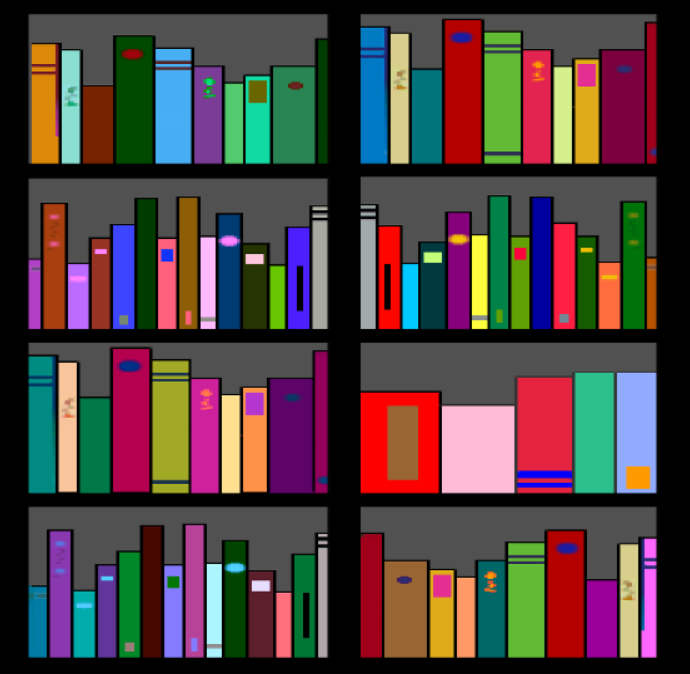
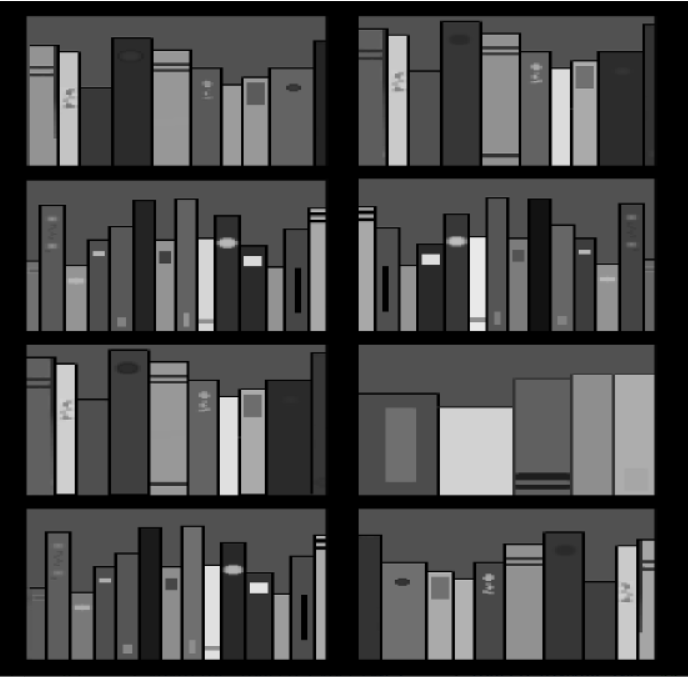
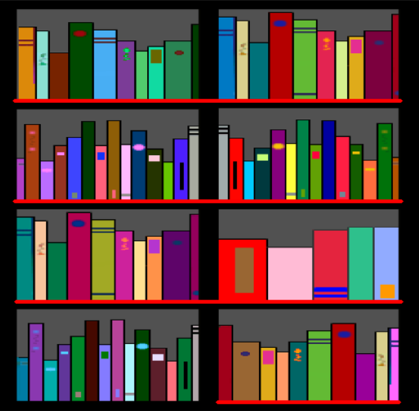
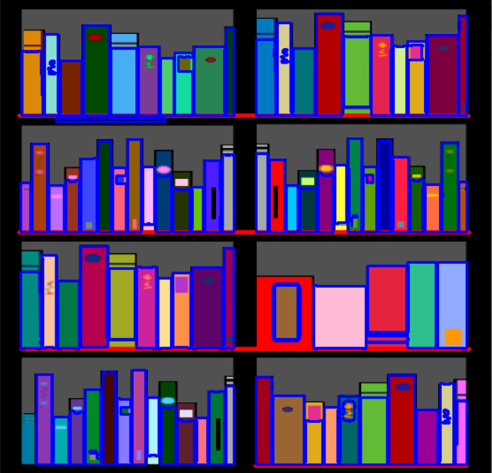

# Обнаружение объектов на изображении и их подсчет.

В данной работе происходит обнаружение книжных полок, подсчет книг на каждой из них, а также определение каких книг больше (по цвету).

*Оригинальное изображение:*

*Преобразуем в 8-ми битовое пространство:*

*Найдем полки на изображении (поиск горизонтальных линий):*

*Ищем книги на изображении:*

Далее определяем цвет центрального пикселя у каждого найденного контура (книги). Суммируем кол-во книг каждого цвета для каждой из полок. Результаты выполнения кода имеют следующий формат: "на n-ой полке больше всего книг ... цвета"
